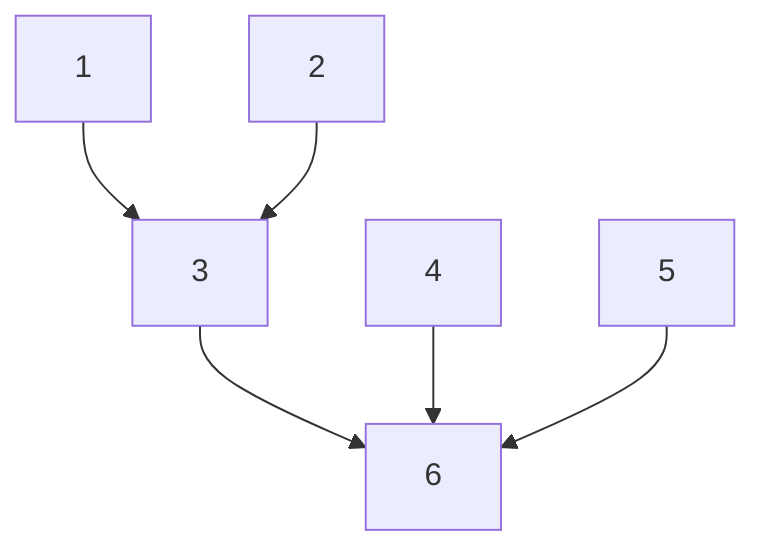

# SNOWCAT: Streamlining Our Workflow: Code Alternative for TRACTOR

Snowcat is a Genome-wide association study (GWAS) pipeline with
correction for local ancestry as estimated with RFMIX.
It follows the model originally introduced by Elizabeth G. Atkinson in the TRACTOR pipeline
(see [manuscript](https://www.nature.com/articles/s41588-020-00766-y), 
[pipeline](https://github.com/Atkinson-Lab/Tractor)).

Snowcat offers a number of advantages

1. Fast, parallel code. 
   - Allows one to rerun the whole GWAS in a matter of hours on a single computer.
2. Returns more test statistics and QC metrics for each variant
   - T-statistic and p-value for each ancestry
   - F-test and p-value for the whole model
   - Minor allele frequency (MAF) and minor allele count (MAC) for each ancestry

## Overview of SNOWCAT pipeline

### Input datasets

1. Genotypes to run GWAS on
   - file format: VCF as returned by an imputation pipeline 
(e.g. [Michigan](https://imputationserver.sph.umich.edu/), 
[TopMed](https://imputation.biodatacatalyst.nhlbi.nih.gov/))
2. Reference genotypes data
   - VCF files, typically 1000 Genomes Reference panel (available for
[hg19](http://hgdownload.cse.ucsc.edu/gbdb/hg19/1000Genomes/phase3/) and
[GRCh38](ftp://ftp.1000genomes.ebi.ac.uk/vol1/ftp/technical/reference/GRCh38_reference_genome/)
genome builds)
3. Ancestry labels for the reference samples ([link](http://ftp.1000genomes.ebi.ac.uk/vol1/ftp/release/20130502/integrated_call_samples_v3.20130502.ALL.panel))
4. Genetic map files for the target genome ([hg19 info](https://www.dropbox.com/s/slchsd0uyd4hii8/genetic_map_b37.zip))

### Pipeline steps

1. Prepare reference panel files
   * Convert the reference panel VCF files
     * Convert to binary vcf format BCF
     * Exclude SNPs with low MAF
     * Keep only genotype information (remove dosage and posterior probability info)
   * Prepare Ancestry labels in RFMIX-friendly format
   * Prepare genetic map files in RFMIX-friendly format
2. Convert and filter genotypes
   * Convert to binary vcf format BCF
   * Exclude SNPs with low MAF and poor imputation quality
   * Keep only genotype information (remove dosage and posterior probability info)
3. Run RFMIX estimation of local ancestry
   * Create MSP.TSV file with ancestry info for each genomic range.
4. Convert Imputed genotypes into a custom binary format for fast parallel GWAS.
   * Convert BCFs from step 2 into VCF for processing in R
   * Convert VCF into custom binary format.
5. Run PCA on imputed genotypes for use as covariates
   * Convert imputed genotypes to plink format by chromosome
   * Prune SNPs for each chromosome
   * Combine pruned SNPs across chromosomes
   * Run PCA on the combined dataset
6. Run GWAS with correction for local ancestry
   * Run R script for every chromosome
   * Combine results, QC, QQ-plot and Manhattan plot.

Here is the dependency chart for the pipeline steps:



### Install Snowcat R package

To install Snowcat R package from GitHub,
run the following code within R

```r
if(!requireNamespace("devtools", quietly = TRUE))
    install.packages("devtools")
devtools::install_github("andreyshabalin/snowcat")
```

# Running SNOWCAT pipeline

## Input data

1. Imputed genotypes

Imputation servers typically return imputed genotypes in files named
`chr1.dose.vcf.gz` to `chr22.dose.vcf.gz`.
The code below assumes the imputed genotypes are stored in `data_vcf_by_chr` directory:

**Genotypes:** `data_vcf_by_chr/chr"$i".dose.vcf.gz`

2. 1000 Genomes reference panel genotypes

The 1000 Genomes project genotypes are freely available online ([hg19](http://hgdownload.cse.ucsc.edu/gbdb/hg19/1000Genomes/phase3/) and
[GRCh38](ftp://ftp.1000genomes.ebi.ac.uk/vol1/ftp/technical/reference/GRCh38_reference_genome/))
in VCF format.
The code below assumes the reference panel file names to be those for hg19 genome build.

**Reference:** `ref_vcf/ALL.chr"$i".phase3_shapeit2_mvncall_integrated_v5a.20130502.genotypes.vcf.gz`

3. Ancestry information for the reference samples

The sample map file for RFMIX. 
The RFMIX [reference manual](https://github.com/slowkoni/rfmix/blob/master/MANUAL.md)
defines its format as follows: 
It is tab delimited text with two columns. The first column gives the sample name or identifier, which must match the one used in the reference VCF/BCF. The second column is a string naming a subpopulation and may contain spaces (e.g., "European", or "East African").

The code below assumes the sample map to be located in the `map` directory:

**Sample map:** `map/1KG_map.txt`

4. Genetic map file for the used genome build.

Genetic map file for RFMIX.
The RFMIX [reference manual](https://github.com/slowkoni/rfmix/blob/master/MANUAL.md)
defines its format as follows:
The 3 columns are chromosome, physical position in bp, genetic position in cM.

Historically, the source data for creation of this file has been available at
[link](https://mathgen.stats.ox.ac.uk/genetics_software/shapeit/shapeit.html/files/genetic_map_b37.tar.gz) which seems to be currently broken.
You may have better luck [here](https://www.dropbox.com/s/slchsd0uyd4hii8/genetic_map_b37.zip) or googling for it.

The code below assumes the genetic map to be located in the `map` directory:

**Genetic map:** `map/map_file.txt`

## 1. Convert the reference panel files

We convert the reference panel VCF files to BCF to achieve several goals.
* Convert from VCF to binary vcf format BCF to greatly speed up processing by RFMIX.
* Exclude SNPs with low MAF. Very low minor allele veriants are not useful for the analysis.
* Keep only genotype information (remove dosage and posterior probability info). This greatly reduces the file size and speeds up processing by RFMIX.

The converted files are saved in `ref_bcf` directory.

<details open>
<summary>Simple bash loop (may be slow)</summary>

```bash
mkdir -p ref_bcf
for chr in {1..22}; do
  bcftools annotate \
    ref_vcf/ALL.chr"$chr".phase3_shapeit2_mvncall_integrated_v5a.20130502.genotypes.vcf.gz \
    -x 'FORMAT' \
    -i 'AF>.001 && AF<.999' \
    -O b9 \
    -o ref_bcf/ref_chr"$chr".bcf.gz
  bcftools index ref_bcf/ref_chr"$chr".bcf.gz
done
```

</details>

<details>
<summary>Parallel bash loop (needs a beefy machine)</summary>

```bash
mkdir -p ref_bcf
parallel --linebuffer "\
  bcftools annotate \
    ref_vcf/ALL.chr{}.phase3_shapeit2_mvncall_integrated_v5a.20130502.genotypes.vcf.gz \
    -x 'FORMAT' \
    -i 'AF>.001 && AF<.999' \
    -O b9 \
    -o ref_bcf/ref_chr{}.bcf.gz && \
  bcftools index ref_bcf/ref_chr{}.bcf.gz" ::: {1..22}
```

</details>

## 2. Convert and filter genotypes

Similarly, we convert the genotype VCF files to BCF.
In addition to previous filtering criteria, we exclude variants with imputation R2 below 0.5.

The converted files are saved in `data_bcf_by_chr_GT_QC` directory.

<details open>
<summary>Simple bash loop (may be slow)</summary>

```bash
mkdir -p data_bcf_by_chr_GT_QC
for chr in {1..22}; do
  bcftools annotate \
    data_vcf_by_chr/chr"$chr".dose.vcf.gz \
    -x 'FORMAT' \
    -i 'R2>.5 & MAF>.001' \
    -O b9 \
    -o data_bcf_by_chr_GT_QC/GT_R2_.5_MAF_.001_chr"$chr".bcf.gz
  bcftools index data_bcf_by_chr_GT_QC/GT_R2_.5_MAF_.001_chr"$chr".bcf.gz
done
```

</details>

<details>
<summary>Parallel bash loop (needs a beefy machine)</summary>

```bash
mkdir -p data_bcf_by_chr_GT_QC
parallel --linebuffer "\
  bcftools annotate \
    data_vcf_by_chr/chr{}.dose.vcf.gz \
    -x 'FORMAT' \
    -i 'R2>.5 & MAF>.001' \
    -O b9 \
    -o data_bcf_by_chr_GT_QC/GT_R2_.5_MAF_.001_chr{}.bcf.gz && \
  bcftools index data_bcf_by_chr_GT_QC/GT_R2_.5_MAF_.001_chr{}.bcf.gz" ::: {1..22}
```

</details>


## 3. Run RFMIX estimation of local ancestry

We can now run RFMIX for each chromosome.
We do not parallelize running RFMIX 
as it is very a memory intensive program.

The RFMIX output is saved in `rfmix_out` directory.

```bash
mkdir -p rfmix_out
for i in {22..1}; do
  rfmix/rfmix \
    --query-file=data_bcf_by_chr_GT_QC/GT_R2_.5_MAF_.001_chr"$i".bcf.gz \
    --reference-file=ref_bcf/ref_chr"$i".bcf.gz \
    --sample-map=map/1KG_map.txt \
    --genetic-map=map/map_file.txt \
    --chromosome="$i" \
    --n-threads=30 \
    --output-basename=rfmix_out/rfmix_chr"$i"_R2_.5_MAF_.001
done
```

**Note:** Replace 30 in `--n-threads=30` to the number of cores on the machine being used.


## 4. Convert Imputed genotypes into a custom binary format for fast parallel GWAS.

First, we convert BCF files from step 2 to VCF for processing in R.

The converted files are saved in `data_vcf_by_chr_GT_QC`.

<details open>
<summary>Simple bash loop (may be slow)</summary>

```bash
mkdir -p data_vcf_by_chr_GT_QC
for chr in {1..22}; do
  bcftools view \
    data_bcf_by_chr_GT_QC/GT_R2_.5_MAF_.001_chr"$chr".bcf.gz \
    -o data_vcf_by_chr_GT_QC/GT_R2_.5_MAF_.001_chr"$chr".vcf.gz \
    -O z1
done
```

</details>

<details>
<summary>Parallel bash loop (needs a beefy machine)</summary>

```bash
mkdir -p data_vcf_by_chr_GT_QC
parallel --linebuffer "\
  bcftools view \
    data_bcf_by_chr_GT_QC/GT_R2_.5_MAF_.001_chr{}.bcf.gz \
    -o data_vcf_by_chr_GT_QC/GT_R2_.5_MAF_.001_chr{}.vcf.gz \
    -O z1 " ::: {1..22}
```

</details>


**Next**, we convert the genotypes to a binary format for fast random access by GWAS code.

The converted files are saved in `data_bcf_by_chr_GT_QC_fm`.

<details open>
<summary>Simple R loop (may be slow)</summary>

```r
library(snowcat)
for( chr in 1:22 ){
  vcffilename = paste0("data_vcf_by_chr_GT_QC/GT_R2_.5_MAF_.001_chr",chr,".vcf.gz")
  fmnameroot = paste0("data_bcf_by_chr_GT_QC_fm/chr",chr)
  convertVCFtoFilematrix(vcffilename, fmnameroot)
}
```

</details>

<details>
<summary>Parallel bash loop (needs a beefy machine)</summary>

```bash
parallel --linebuffer "\
  Rscript -e \"\
    chr = {}; \
    library(snowcat); \
    vcffilename = paste0('data_vcf_by_chr_GT_QC/GT_R2_.5_MAF_.001_chr',chr,'.vcf.gz'); \
    fmnameroot = paste0('data_bcf_by_chr_GT_QC_fm/chr',chr); \
    convertVCFtoFilematrix(vcffilename, fmnameroot); \
  \"" ::: {1..22}
```

</details>

## 5. Run PCA on imputed genotypes for use as covariates

Any GWAS analysis should include correction for a number of ancestry PCs.
Thus, we run PCA analysis on the imputed genotypes

The PCA analysis and intermediate plink files are saved in `data_plink` directory. \

<details open>
<summary>Simple bash loop (may be slow)</summary>

```bash
mkdir -p data_plink

for chr in {1..22}; do

  # Convert imputed genotypes to plink format by chromosome
  # and filter by minor allele frequency
  plink2 \
    --vcf data_vcf_by_chr_GT_QC/GT_R2_.5_MAF_.001_chr"$chr".vcf.gz \
    --double-id \
    --make-bed \
    --maf 0.01 \
    --out data_plink/chr"$chr"
    
  # Prune SNPs for each chromosome
  plink \
    --bfile data_plink/chr"$chr" \
    --indep-pairphase 1000 10 0.2 \
    --out data_plink/prune."$chr"
    
  plink2 \
    --bfile data_plink/chr"$chr" \
    --extract data_plink/prune."$chr".prune.in \
    --make-pgen \
    --out data_plink/chr"$chr".p
    
done

# Combine pruned SNPs across chromosomes
if [ -f data_plink/1list.txt ]; then
  rm data_plink/1list.txt
fi
for chr in {1..22}; do
  echo data_plink/chr"$chr".p >> data_plink/1list.txt
done

plink2 \
  --pmerge-list data_plink/1list.txt \
  --make-pgen \
  --out data_plink/all_chr

# Run PCA in pruned SNPs, extract top 250 PCs
plink2 \
  --pfile data_plink/all_chr \
  --pca 250 \
  --out data_plink/pca

```

</details>

<details>
<summary>Parallel bash loop (needs a beefy machine)</summary>

```bash
mkdir -p data_plink

# Convert imputed genotypes to plink format by chromosome
# Filter by minor allele frequency
# Prune SNPs for each chromosome
parallel --linebuffer "\
  plink2 \
    --vcf data_vcf_by_chr_GT_QC/GT_R2_.5_MAF_.001_chr{}.vcf.gz \
    --double-id \
    --make-bed \
    --maf 0.01 \
    --out data_plink/chr{} && \
  plink \
    --bfile data_plink/chr{} \
    --indep-pairphase 1000 10 0.2 \
    --out data_plink/prune.{} && \
  plink2 \
    --bfile data_plink/chr{} \
    --extract data_plink/prune.{}.prune.in \
    --make-pgen \
    --out data_plink/chr{}.p" ::: {1..22}


# Combine pruned SNPs across chromosomes
if [ -f data_plink/1list.txt ]; then
  rm data_plink/1list.txt
fi
for chr in {1..22}; do
  echo data_plink/chr"$chr".p >> data_plink/1list.txt
done

plink2 \
  --pmerge-list data_plink/1list.txt \
  --make-pgen \
  --out data_plink/all_chr

# Run PCA in pruned SNPs, extract top 250 PCs
plink2 \
  --pfile data_plink/all_chr \
  --pca 250 \
  --out data_plink/pca

```

</details>

The PCs are saved in the `data_plink/pca.eigenvec` file.


## 6. Run GWAS with correction for local ancestry.

Running GWAS for each chromosome
can be parallelized across CPU cores of the machine.

```r
# Number of principal components to correct for
npcs = 20;

# Chromosome number
chr = 22;

# File name for the filematrix with genotypes
fmifilename = paste0("data_bcf_by_chr_GT_QC_fm/chr",chr);

# Estimated local ancestry from RFMIX
mspfilename = paste0("rfmix_out/rfmix_chr",chr,"_R2_.5_MAF_.001.msp.tsv")

# Output directory
outputdir = paste0("gwas/pc",npcs, "_linear");

# Data frame with covariates
pca = fread("data_plink/pca.eigenvec",
            header = TRUE,
            data.table = FALSE);
cvrt = as.matrix(pca[ paste0("PC", seq_len(npcs)) ]);
rownames(pca) = pca$IID;
rm(npcs, pca);

# Outcome variable
samples = fread(file = paste0(fmifilename,".samples"), sep = "", quote = FALSE, header = FALSE)[[1]];
tmp = substr(samples, 1, 1);
phenotype = as.numeric(tmp == tail(tmp,1))
rm(samples, tmp);

run.gwas.linear(
    chr,
    fmifilename,
    mspfilename,
    outputdir,
    cvrt,
    phenotype)

gwas = data.table::fread("gwas/pc20_linear/gwas_chr22.sumstat.txt", nrow = 2)

```

Here is the preview of GWAS results with QC metrics:

|     Field          |      SNP1      |     SNP2       |
|:-------------------|---------------:|---------------:|
|chr                 |22              |22              |
|pos                 |17031494        |17066596        |
|ID                  |22:17031494:A:G |22:17066596:A:G |
|ref                 |A               |A               |
|alt                 |G               |G               |
|AlleleTotal_AFR     |392             |392             |
|AlleleTotal_AMR     |1345            |1345            |
|AlleleTotal_EAS     |8806            |8806            |
|AlleleTotal_EUR     |56642           |56642           |
|AlleleTotal_SAS     |1511            |1511            |
|AltAlleleCnt_AFR    |29              |0               |
|AltAlleleCnt_AMR    |35              |6               |
|AltAlleleCnt_EAS    |95              |20              |
|AltAlleleCnt_EUR    |2750            |430             |
|AltAlleleCnt_SAS    |58              |2               |
|MinorAlleleFreq_AFR |0.07397         |0.00000         |
|MinorAlleleFreq_AMR |0.02602         |0.00446         |
|MinorAlleleFreq_EAS |0.01078         |0.00227         |
|MinorAlleleFreq_EUR |0.04855         |0.00759         |
|MinorAlleleFreq_SAS |0.03838         |0.00132         |
|Nca_AFR             |53              |53              |
|Nca_AMR             |304.5           |304.5           |
|Nca_EAS             |89.5            |89.5            |
|Nca_EUR             |5119.5          |5119.5          |
|Nca_SAS             |19.5            |19.5            |
|Nco_AFR             |143             |143             |
|Nco_AMR             |368             |368             |
|Nco_EAS             |4313.5          |4313.5          |
|Nco_EUR             |23201.5         |23201.5         |
|Nco_SAS             |736             |736             |
|beta_AFR            |-0.05349        | NA             |
|beta_AMR            | 0.03792        | 0.25132        |
|beta_EAS            |-0.00133        |-0.00941        |
|beta_EUR            | 0.00360        |-0.02690        |
|beta_SAS            | 0.00093        |-0.00779        |
|zscore_AFR          |-0.779          | NA             |
|zscore_AMR          | 0.645          | 1.797          |
|zscore_EAS          |-0.037          |-0.123          |
|zscore_EUR          | 0.530          |-1.635          |
|zscore_SAS          | 0.020          |-0.032          |
|pvalue_AFR          | 0.4356         | NA             |
|pvalue_AMR          | 0.5183         | 0.0722         |
|pvalue_EAS          | 0.9698         | 0.9019         |
|pvalue_EUR          | 0.5959         | 0.1020         |
|pvalue_SAS          | 0.9839         | 0.9742         |
|R2                  | 0.00013        | 0.00026        |
|Ftest               | 0.502          | 1.142          |
|Pvalue              | 0.873          | 0.330          |
 


